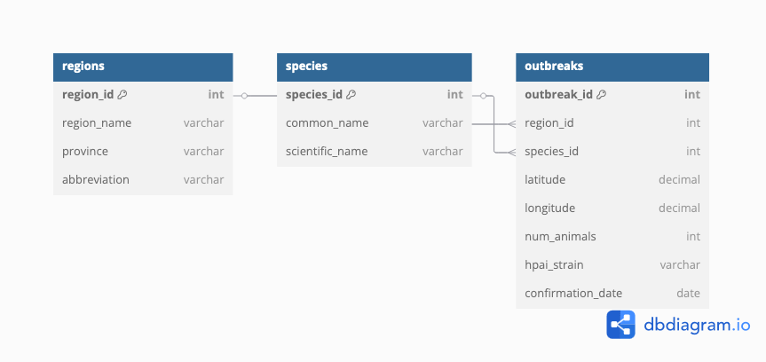
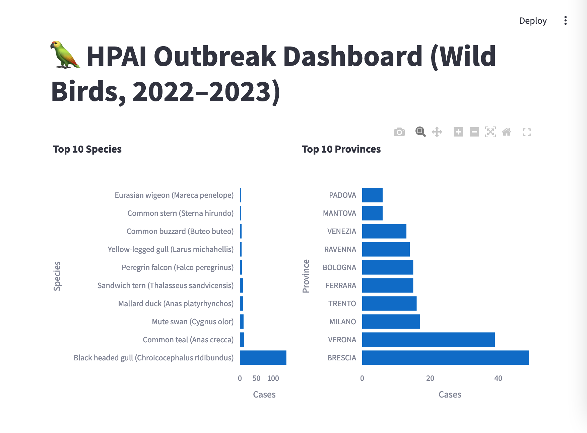

# 🦜 Parrot Health DB – Avian Flu Outbreak Tracker (2022–2023)

This project is a professional portfolio demonstrating database analysis for veterinary data, focusing on avian influenza (HPAI) outbreaks among wild birds in Italy during 2022–2023.

## 📊 Dataset

**Source:** Italian veterinary authority (open data)  
**File:** `hpai-wild-birds-2022-2023.csv`  
**Content includes:**
- Region, Province
- Bird species (e.g. Mallard, Greylag goose)
- Number of infected animals
- Latitude / Longitude
- HPAI strain (H5N1)
- Confirmation dates

## 🧱 Database Schema (Planned)

| Table | Description |
|-------|-------------|
| `outbreaks` | Contains details of each reported case |
| `species` | Bird species taxonomy |
| `regions` | Geolocation and regional metadata |

## 🧠 Example Questions to Analyze

- Which bird species are most affected by H5N1?
- What regions report the most cases?
- Is there a seasonal pattern in outbreak dates?
- Can geospatial clustering of infections be observed?

## 🧪 Tools

- PostgreSQL / SQLite (Schema + Querying)
- Python (Pandas / Jupyter)
- Git / GitHub for version control

## 🗺️ Entity-Relationship Diagram



## 📊 Dashboard Preview




---

## 🚀 Interactive Dashboard (Streamlit)

This project includes a live dashboard built with Streamlit and Plotly.

- 📌 Filter by bird species and province
- 📊 Visualize top 10 infected species
- 📍 See outbreak distribution across provinces

To run locally:

```bash
streamlit run streamlit_app.py

---

## 📊 Dashboard Preview

The following interactive dashboard was built with Streamlit to explore the avian flu outbreak dataset:


> Filter by species and province, and visualize top affected bird types and locations.

To launch locally:

```bash
streamlit run streamlit_app.py


---

## 📌 Author

**Saran (Mook)**  
GitHub: [@mooksaran](https://github.com/mooksaran)

---
